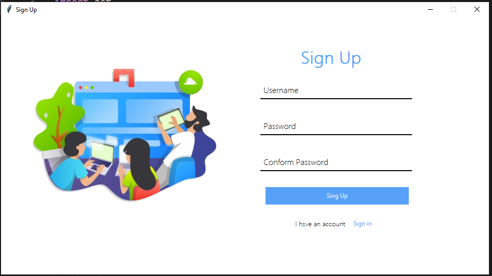

# 🔐 Sign Up System using Tkinter & AST

Welcome to the **Sign Up System**, a simple Python GUI application designed to register users with a username and password. Built using **Tkinter** for the interface and Python's **AST** module for basic data storage, this project provides a beginner-friendly yet structured way to handle user registration.

---

## 🔍 Overview

The Sign Up System allows users to create accounts by entering a username and matching passwords. It validates user input and stores the credentials in a dictionary format within a local text file (`datasheet.txt`). Designed with a modern layout and clean interface, this app is ideal for learning GUI-based user authentication.

---

## 🚀 Features

* 🖥️ **Graphical Interface with Tkinter**: Clean and responsive user interface.
* 🧠 **Password Confirmation**: Ensures both passwords match before saving.
* 💾 **File-based Storage**: Uses `ast` to safely handle and store user data in `datasheet.txt`.
* 🔐 **Error Handling**: Displays error messages for mismatched passwords or file access issues.
* 🔁 **Redirect to Sign-in**: A button for navigating to the Sign-in screen.
* 🖼️ **Custom UI Image**: Displays a user-friendly image for better design.

---

## 🧠 Learning Highlights

This project introduces key concepts in building user-centric desktop applications, including:

* GUI development using Tkinter
* Handling text files and data conversion with `ast`
* Creating clean and reusable UI code
* Input validation and feedback using `messagebox`

---

## 🗃️ File Structure

```
📁 Sign-Up-System
├── signup.py               # Main application script
├── datasheet.txt           # Auto-generated file storing user credentials
├── login.png               # Image used in the GUI
├── README.md               # Project documentation
```

> ⚠️ Note: The `datasheet.txt` file is created/updated automatically upon sign-up.

---

## ⚙️ Requirements

Install Python 3.x. No additional libraries are needed beyond the Python standard library.

---

## ▶️ How to Run

1. Clone this repository:

   ```bash
   git clone https://github.com/mian-arham-haroon/sign-up-system.git
   ```
2. Navigate to the project folder:

   ```bash
   cd sign-up-system
   ```
3. Run the application:

   ```bash
   python signup.py
   ```

---
## 📸 Screenshot



## 💡 Optional Enhancements

* Implement password encryption using `hashlib`
* Add database support (SQLite, MySQL)
* Integrate email confirmation
* Design a login page and connect it with this system

---

## 📌 Conclusion

This Sign-Up System is a solid starting point for anyone looking to understand Python GUI programming and local data handling. Explore the code, enhance the functionality, and use it in your future desktop applications!
